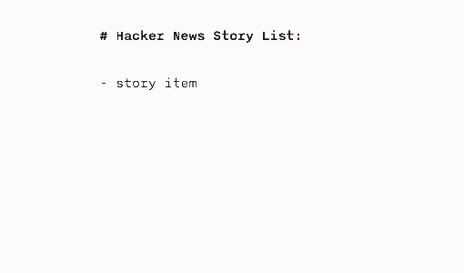

**Web Developer Test Project - Hacker News Reader**

You will be building a news reader app which displays the latest[ Hacker News](https://news.ycombinator.com/) stories. Your app will leverage the[ Hacker News API](https://github.com/HackerNews/API) to fetch data it requires.

_Note: We will abbreviate Hacker News as HN for this project._

# **Requirements**

The app will be a single page web app will the following features:

- The app will display a list of the latest Hacker News stories in descending order from newest to oldest. Each list item should show the title (which should link to the story), author name, and posted time.

- The targeted users for this app are exceptionally inpatient, so the app needs to display each HN list item _as soon as it has been fetched_. The resulting list will look like it is populating new items one-by-one, as seen below.

- The app should support infinite scroll (like Facebook News Feed). Specifically, when the user reaches the bottom of the page, the app should fetch earlier items and display them.

- The app should support offline capability. Specifically, the user should be able to use the app offline to check out the list.

- You can assume that the app will only be run on modern browsers, hence feel free to use latest web spec if needed.

# **Evaluation Criteria**

- App performance. We will be looking at the wait times for reader to see the content — the shorter, the better.

- We will evaluate your code’s quality. Does your code have good modular design and testability? Is it easy to read?

- We prefer the project to be lightweight, and all dependencies should be well justified.

# **Deliverable**

- Upload your test project as a public repository on Github. Please make sure to include a readme file with instructions on how to run your app.

- Make sure your project is easy to setup. Your app should be ready to run after npm install.

- Please spend no more than 12 hours on this task.

- Test project will be compensated
